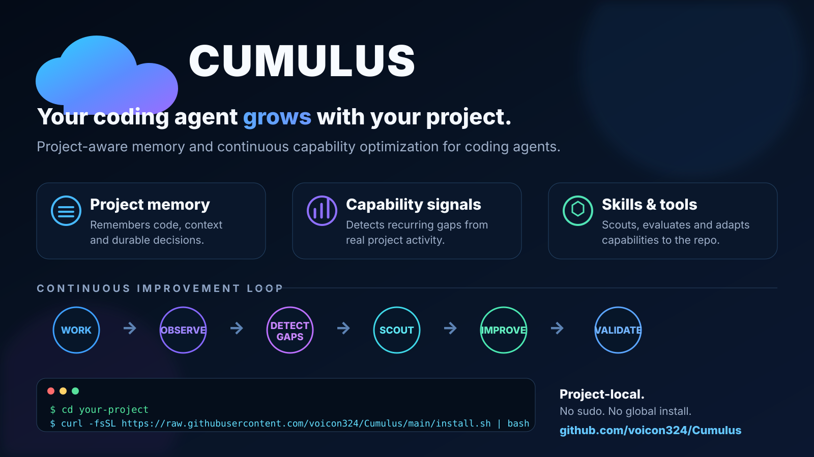

# Cumulus

**Your coding agent grows with your project.**

Project-aware capability optimization and memory for coding agents.

<p align="center">
  
</p>

## What is Cumulus?

Cumulus is a project-memory and capability-optimization layer for **Codex, Claude Code, Cursor, Gemini CLI and other Agent Skills-compatible coding agents**.

Use it when you want:

- persistent **project memory for a coding agent**;
- a **self-improving coding-agent workflow**;
- repository conventions and architecture decisions preserved across tasks;
- **Agent Skills discovery** based on current project needs;
- MCP server, CLI and developer-tool discovery;
- repeated-failure and capability-gap detection;
- project-aware agent retrospectives without storing full chat transcripts.

### Install as an Agent Skill

```bash
npx skills add voicon324/Cumulus --list
npx skills add voicon324/Cumulus --skill cumulus
```

Canonical skill: [`skills/cumulus/SKILL.md`](skills/cumulus/SKILL.md).

The full project-local runtime below adds persistent state, task evidence, capability-debt detection, reviews and improvement trials.


Cumulus installs inside a repository, builds a lightweight project model, gives coding agents durable project memory, detects repeated capability gaps, and helps them discover better skills, tools, and workflows as the project evolves.

It is designed to be something you add **inside the repo you are about to work on**, not another global developer tool.

## Install in a repository

```bash
cd your-project
curl -fsSL https://raw.githubusercontent.com/voicon324/Cumulus/main/install.sh | bash
```

No `sudo`. No global PATH changes. The runtime is installed locally in the project.

Want to inspect the installer first?

```bash
curl -fsSL https://raw.githubusercontent.com/voicon324/Cumulus/main/install.sh -o /tmp/cumulus-install.sh
less /tmp/cumulus-install.sh
bash /tmp/cumulus-install.sh
```

## What happens on install

Cumulus will:

1. detect the repository root;
2. install a local runtime under `.cumulus-runtime/`;
3. create a local `./cumulus` launcher;
4. profile the repo and initialize `.cumulus/` project state;
5. preserve existing `AGENTS.md` content and add a managed integration block;
6. create an initial capability/scouting baseline;
7. stay available during development for project memory, capability debt, and improvement review.

```text
repo/
├── cumulus                  # local launcher, gitignored
├── .cumulus-runtime/        # local runtime, gitignored
├── .cumulus/                # project model / evidence / capability state
├── AGENTS.md                # agent integration block
└── ...your project
```

## Why

Coding agents often begin with generic capability and repeatedly rediscover the same project-specific knowledge. Cumulus treats an agent's capability set like a living project dependency.

The intended loop is:

```text
understand project
      ↓
work on tasks
      ↓
observe meaningful outcomes
      ↓
detect repeated gaps or new domains
      ↓
discover prior art / skills / tools
      ↓
trial improvements
      ↓
keep or roll back based on evidence
```

A single ordinary failure should not rewrite a skill. Cumulus accumulates structured evidence first.

## Autonomy levels

Cumulus uses one optimizer with configurable permission to act:

| Level | Behavior |
|---:|---|
| `0` | Observe and maintain project memory only |
| `1` | Observe and queue justified suggestions *(default)* |
| `2` | May auto-apply low-risk reversible project-local improvements |
| `3` | May autonomously scout/trial/validate reversible improvements within granted permissions |

Credentials, paid services, destructive actions, security-sensitive changes, and system-level changes remain protected.

## Everyday commands

```bash
./cumulus status
./cumulus profile
./cumulus doctor
./cumulus review
./cumulus improvements
```

For substantial tasks, an integrated coding agent can record structured outcomes:

```bash
./cumulus task-start \
  --task-id AUTH-01 \
  --domain authentication \
  --goal "Add JWT authentication"

./cumulus task-end \
  --result success \
  --effort medium
```

When a new domain appears:

```bash
./cumulus scout-plan --domain payments
```

## When should a coding agent use Cumulus?

Typical intents that should semantically match Cumulus:

> “My coding agent keeps forgetting how this repository works.”

> “Find existing skills, MCPs and workflows before building this capability from scratch.”

> “The agent keeps failing on migrations. Review the history and decide whether its workflow needs improvement.”

> “I want my coding agent to learn project conventions over time.”

> “How can my AI coding agent remember technical decisions between tasks?”

These intents are encoded directly in the Agent Skill metadata so coding agents can discover Cumulus by purpose rather than by brand name.

## Machine-readable discovery

- [`skills/cumulus/SKILL.md`](skills/cumulus/SKILL.md) — Agent Skills package
- [`skills.sh.json`](skills.sh.json) — skills.sh grouping metadata
- [`llms.txt`](llms.txt) — concise machine-readable product description and canonical links
- [`skills/cumulus/evals/evals.json`](skills/cumulus/evals/evals.json) — trigger/evaluation examples
- [`docs/use-cases.md`](docs/use-cases.md) — concrete project-memory and capability-optimization scenarios

Useful semantic search phrases:

```text
coding agent project memory
persistent memory for coding agents
self improving coding agent
continuous agent optimization
agent capability management
Agent Skills discovery
project-aware coding agent
repository memory for AI agents
MCP discovery for coding agents
```

## Project memory, not transcript storage

Cumulus does **not** need to store full chat transcripts. It records meaningful structured events such as:

- task success/failure;
- repeated retries;
- manual intervention;
- user correction;
- new domains;
- dependency changes;
- durable architecture decisions;
- improvement trials and outcomes.

This evidence is compacted into a project model and capability picture over time.

## Current status

This project is early-stage (`v0.2.x`). The local runtime, project profiling, task evidence, capability-debt detection, improvement queue/trials, skill provenance lock, compaction, review, and `AGENTS.md` integration are implemented.

Skill/MCP discovery currently relies on the coding agent's available web/GitHub/registry tools; Cumulus manages the reason, evidence, state, and outcome of that discovery rather than silently executing arbitrary external code.

See [CHANGELOG.md](CHANGELOG.md) for details.

## Run the smoke test

```bash
bash scripts/smoke-test.sh
```

## Repository-local development install

From this source checkout, install into another repo with:

```bash
bash scripts/install-repo.sh --repo /path/to/project
```

## Security model

Cumulus deliberately distinguishes observation from permission to change things. External skills and tools should be inspected before use, and higher-risk changes require approval even at high autonomy levels.

Please report security issues according to [SECURITY.md](SECURITY.md).

## Contributing

Issues, experiments, integration ideas, and pull requests are welcome. See [CONTRIBUTING.md](CONTRIBUTING.md).

## License

MIT — see [LICENSE](LICENSE).
